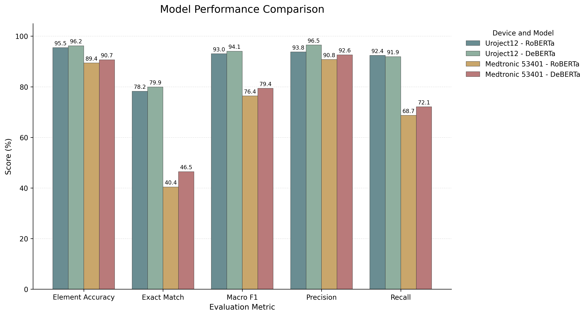
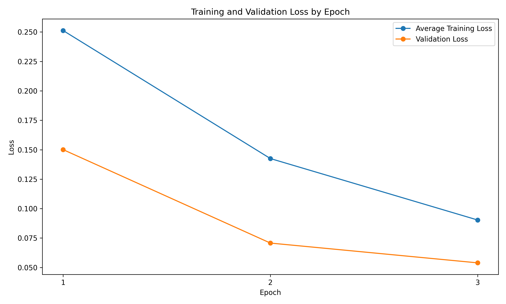
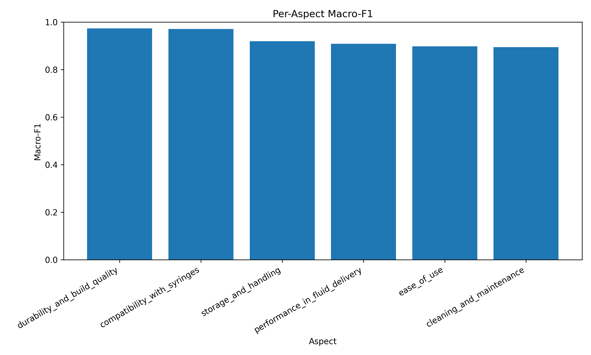
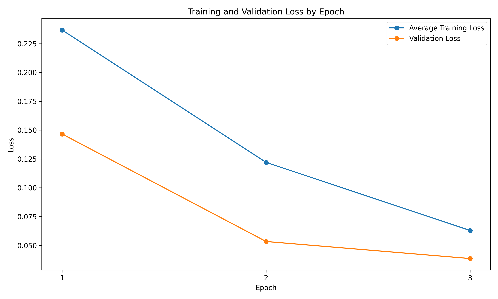
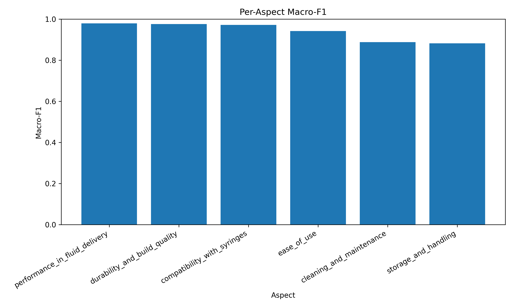
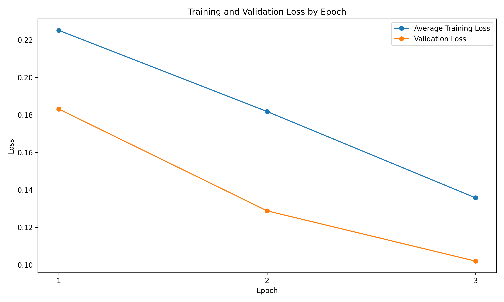
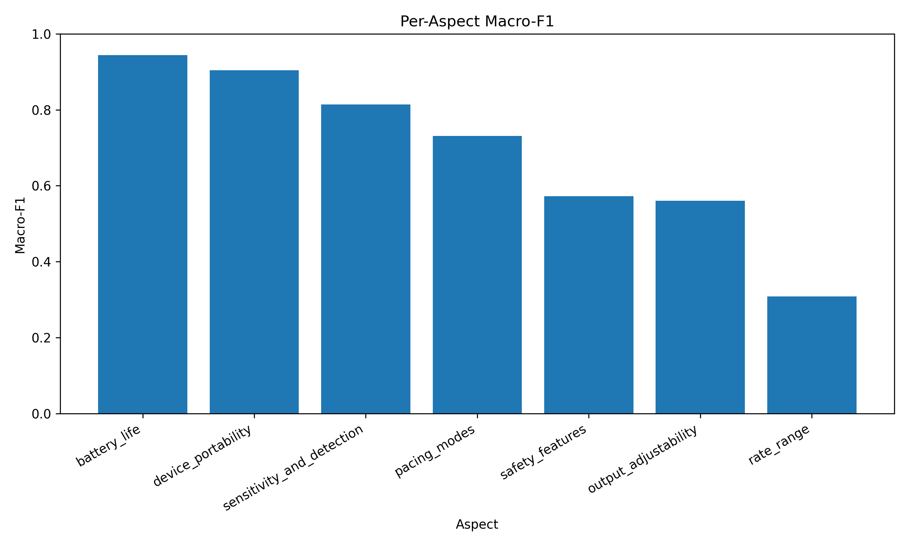
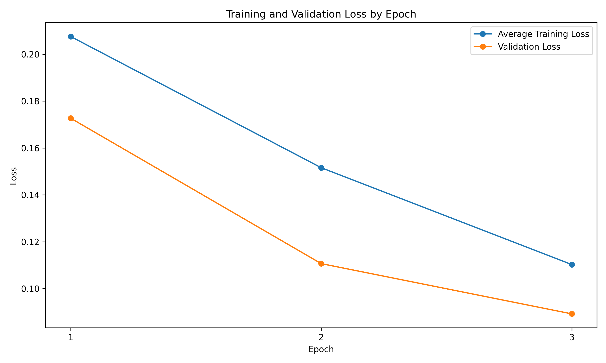
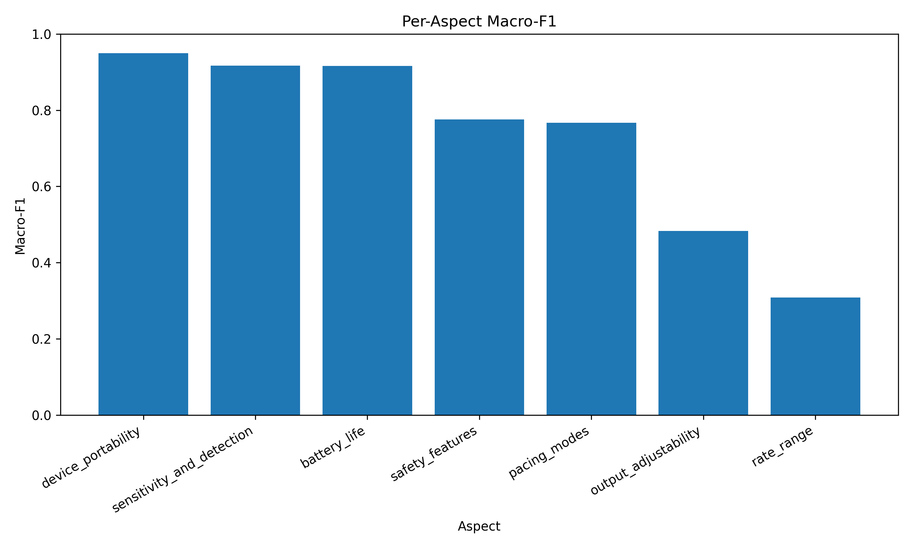

# Automated Generation of ABSA Models for Medical Devices Using Synthetic Data

This project implements an end-to-end NLP pipeline for automatically generating synthetic medical-device reviews and training transformer-based models for aspect-level sentiment prediction.

The pipeline receives medical device documentation as input, extracts product-specific aspects and nuance attributes using an LLM, generates labeled synthetic reviews, validates the generated data, and fine-tunes transformer models to predict sentiment scores for each extracted aspect.

The project was demonstrated on two medical devices:

- Uroject12 Syringe Lever
- Medtronic 53401 Single-Chamber Temporary Pacemaker

---

## Team Members

- Shoham Rachel Amira
- Adi Malka

Lecturer: Dr. Aparcin Alexander

---

## Project Motivation

Medical device reviews can include feedback across many domains, such as safety, usability, operation, performance, maintenance, compatibility, and user experience.

However, creating labeled datasets for Aspect-Based Sentiment Analysis requires significant manual annotation. This becomes more challenging because each medical device has different characteristics, meaning that the relevant aspects may differ from one device to another.

This project addresses this challenge by using medical device documentation and LLM-based generation to create validated synthetic review datasets for aspect-level sentiment prediction.

---

## Problem Statement

Medical device feedback is often written as unstructured free text. A single review may refer to several different product-related aspects, and the relevant aspects are not fixed across all medical devices.

Because each device has its own functionality, usage context, and technical characteristics, it is difficult to reuse a single predefined aspect schema or a single labeled dataset across multiple devices.

The main problem addressed in this project is the lack of labeled aspect-level datasets for medical devices. To reduce manual annotation effort, this project builds an automated pipeline that extracts device-specific aspects from medical documentation, generates synthetic labeled reviews, validates the generated data, and trains aspect-scoring models.

---

## Visual Abstract

The following diagram summarizes the end-to-end pipeline, from medical device documentation to synthetic review generation, validation, model training, and evaluation.

```mermaid
flowchart LR
    A[Medical Device Documentation] --> B[Documentation Text Extraction]
    B --> C[Text Cleaning and Chunking]
    C --> D[Aspect Extraction]
    D --> E[Nuance Attribute Extraction]
    E --> F[Review Planning]
    F --> G[Synthetic Review Generation]
    G --> H[Validation and Quality Assurance]
    H --> I[RoBERTa / DeBERTa Training]
    I --> J[Evaluation and Visualization]
```



---

## Datasets Used or Collected

The project includes two synthetic datasets, each generated from medical device documentation.

| Dataset | Source Device | Reviews After Deduplication | Extracted Aspects |
|---|---|---:|---:|
| Uroject12 | Syringe lever documentation | 1960 | 6 |
| Medtronic 53401 | Temporary pacemaker documentation | 1980 | 7 |

Each dataset contains synthetic review records with:

- review text
- selected aspects
- aspect score vector
- nuance attributes

The datasets were generated automatically using an LLM and then validated using rule-based and LLM-based quality checks.

---

## Data Augmentation and Generation Methods

Synthetic reviews were generated using a controlled LLM-based process with the OpenAI API (`gpt-4.1-mini`).

The generation process included:

1. Extracting product-specific aspects from the medical device documentation.
2. Extracting nuance attributes to diversify the review context.
3. Planning each review before generation by selecting aspects, sentiment values, and nuance attributes.
4. Generating the final synthetic review text according to the planned labels.
5. Validating whether the generated review text matched the assigned aspect scores.
6. Removing duplicate reviews and saving the final cleaned dataset.

This controlled generation strategy was used to ensure that the generated review text and the assigned labels were aligned.

---

## Input / Output Examples

This project uses an ABSA-inspired multi-output aspect scoring approach.

Given a review text, the model predicts a sentiment score for every extracted aspect.

```text
Review text → Aspect score vector
```

Score meaning:

```text
 1  = positive mention
-1  = negative mention
 0  = aspect not mentioned
```

Example generated synthetic review records:

```json
[
  {
    "review": "The syringe lever is really easy to operate, making my tasks much smoother.",
    "aspects": ["ease_of_use"],
    "aspect_scores": {
      "ease_of_use": 1,
      "durability_and_build_quality": 0,
      "cleaning_and_maintenance": 0,
      "compatibility_with_syringes": 0,
      "storage_and_handling": 0,
      "performance_in_fluid_delivery": 0
    },
    "nuance_attributes": {
      "usage_context": "research_lab",
      "writing_style": "casual",
      "review_detail_level": "overview"
    }
  },
  {
    "review": "The storage instructions are confusing and the device seems vulnerable to damage if not handled exactly as specified.",
    "aspects": ["storage_and_handling"],
    "aspect_scores": {
      "ease_of_use": 0,
      "durability_and_build_quality": 0,
      "cleaning_and_maintenance": 0,
      "compatibility_with_syringes": 0,
      "storage_and_handling": -1,
      "performance_in_fluid_delivery": 0
    },
    "nuance_attributes": {
      "review_purpose": "critical",
      "usage_context": "training_session"
    }
  }
]
```

---

## Models and Pipelines Used

The project pipeline contains the following stages:

1. Medical device documentation collection
2. text extraction
3. Text cleaning and chunking
4. Aspect extraction
5. Nuance attribute extraction
6. Review planning
7. Synthetic review generation
8. Dataset validation and quality assurance
9. Duplicate removal
10. LLM consistency audit
11. Model training
12. Model evaluation
13. Results visualization

Two transformer-based models were trained and compared:

### RoBERTa

Baseline transformer model.

```text
Model: RoBERTa-base
Task: multi-output aspect-score regression
Input: review text
Output: continuous aspect-score vector
```

### DeBERTa

Improved transformer model.

```text
Model: DeBERTa-v3-small
Task: multi-output aspect-score regression
Input: review text
Output: continuous aspect-score vector
```

---

## Training Process and Parameters

The models were trained using a multi-output regression setup.

Loss function:

```text
MSE = 1/n Σ(yᵢ - ŷᵢ)²
```

Prediction thresholds:

```text
ŷ ≥ 0.5   → Positive / mentioned positively
ŷ ≤ -0.5  → Negative / mentioned negatively
otherwise → Not mentioned
```

Training configuration:

```text
Batch size: 8
Learning rate: 1e-5
Epochs: 3
Dropout: 0.2 for RoBERTa, 0.1 for DeBERTa
Weight decay: 0.05 for RoBERTa, 0.01 for DeBERTa
Dynamic padding
Early stopping
Best checkpoint selected using validation loss
```

---

## Metrics

The models were evaluated using the following metrics:

- Element Accuracy
- Exact Vector Match
- Macro F1
- Precision
- Recall
- Confusion Matrix
- Per-aspect Macro F1
- Training and Validation Loss

---

## Results

### Results Comparison

The following graph compares the four trained models across the main evaluation metrics.



### Model Comparison Table

| Device | Model | Accuracy | Exact Match | Macro F1 | Precision | Recall |
|---|---|---:|---:|---:|---:|---:|
| Uroject12 | RoBERTa | 95.5% | 78.2% | 93.0% | 93.8% | 92.4% |
| Uroject12 | DeBERTa | 96.2% | 79.9% | 94.1% | 96.5% | 91.9% |
| Medtronic 53401 | RoBERTa | 89.4% | 40.4% | 76.4% | 90.8% | 68.7% |
| Medtronic 53401 | DeBERTa | 90.7% | 46.5% | 79.4% | 92.6% | 72.1% |

DeBERTa achieved stronger overall performance than RoBERTa across most evaluation metrics.

---

### Uroject12 - RoBERTa

| Metric | Score |
|---|---:|
| Element Accuracy | 95.5% |
| Exact Vector Match | 78.2% |
| Macro F1 | 93.0% |
| Precision | 93.8% |
| Recall | 92.4% |





---

### Uroject12 - DeBERTa

| Metric | Score |
|---|---:|
| Element Accuracy | 96.2% |
| Exact Vector Match | 79.9% |
| Macro F1 | 94.1% |
| Precision | 96.5% |
| Recall | 91.9% |





---

### Medtronic 53401 - RoBERTa

| Metric | Score |
|---|---:|
| Element Accuracy | 89.4% |
| Exact Vector Match | 40.4% |
| Macro F1 | 76.4% |
| Precision | 90.8% |
| Recall | 68.7% |





---

### Medtronic 53401 - DeBERTa

| Metric | Score |
|---|---:|
| Element Accuracy | 90.7% |
| Exact Vector Match | 46.5% |
| Macro F1 | 79.4% |
| Precision | 92.6% |
| Recall | 72.1% |





---

## Validation and Quality Assurance

The generated datasets were validated using several checks:

- JSON validation
- Duplicate detection and removal
- Label consistency checks
- Aspect distribution analysis
- Sentiment distribution analysis
- Manual review sampling
- LLM consistency audit

Validation summary:

| Dataset | Reviews After Deduplication | Invalid Rows | Removed Duplicates | Manual Review Sampling | LLM Consistency Rate |
|---|---:|---:|---:|---:|---:|
| Uroject12 | 1960 | 0 | 40 | 98% | 99.17% |
| Medtronic 53401 | 1980 | 0 | 20 | 99% | 96.79% |

---

## Extracted Aspects

### Uroject12

Extracted aspects include:

- Ease of Use
- Durability and Build Quality
- Cleaning and Maintenance
- Compatibility with Syringes
- Storage and Handling
- Performance in Fluid Delivery

### Medtronic 53401

Extracted aspects include:

- Battery Life
- Pacing Modes
- Device Portability
- Output Adjustability
- Sensitivity and Detection
- Safety Features
- Rate Range

---

## Repository Structure

```text
review_generator/
│
├── data/
│   ├── MEDTRONIC_53401/
│   │   ├── raw/
│   │   ├── processed/
│   │   ├── models/
│   │   ├── results/
│   │   └── validation/
│   │
│   └── uroject12/
│       ├── raw/
│       ├── processed/
│       ├── models/
│       ├── results/
│       └── validation/
│
├── docs/
│   └── results/
│       ├── model_performance_comparison.png
│       └── model_performance_comparison.csv
│
├── src/
│   ├── evaluation/
│   ├── extraction/
│   ├── generation/
│   ├── preprocessing/
│   ├── prompts/
│   ├── training/
│   ├── validation/
│   └── visualization/
│
├── presentations/
│   ├── interim_presentation.pdf
│   ├── interim_presentation.pptx
│   ├── final_presentation.pdf
│   └── final_presentation.pptx
│
├── config.py
├── main.py
├── models.py
├── requirements.txt
├── README.md
└── .gitignore
```

---

## Main Folders

### `data/raw`

Contains the original medical device documentation files, such as manuals, specification sheets, and instruction documents.

### `data/processed`

Contains processed pipeline outputs, including extracted aspects, extracted nuance attributes, generated synthetic reviews, and deduplicated review datasets.

Main files:

```text
aspects.json
nuance_attributes.json
synthetic_reviews_2000.jsonl
synthetic_reviews_2000_dedup.jsonl
```

### `data/validation`

Contains dataset validation and quality assurance outputs.

Main files:

```text
quality_report.json
manual_review_sample.csv
llm_consistency_audit_results.jsonl
```

### `data/results`

Contains model evaluation outputs, metrics, confusion matrices, and visualizations.

Main files:

```text
overall_test_metrics.json
per_aspect_metrics.csv
per_aspect_confusion_matrices.json
plots/
```

### `data/models`

Contains output folders for trained Hugging Face models.

Large model binaries and training checkpoints were excluded from GitHub to keep the repository lightweight.

Model folders include:

```text
roberta_aspect_scores/
deberta_aspect_scores/
```

### `docs/results`

Contains general result visualizations used in the README, including the model comparison graph.

### `presentations`

Contains the interim and final project presentations in PDF and PowerPoint formats.

---

## Source Code Structure

### `src/preprocessing`

Contains PDF processing utilities.

Main file:

```text
pdf_utils.py
```

Responsible for extracting and preparing text from medical device documentation.

### `src/extraction`

Contains the logic for automatic aspect and nuance extraction.

Main files:

```text
aspect_extractor.py
nuance_extractor.py
```

### `src/generation`

Contains the synthetic review generation logic.

Main files:

```text
review_planner.py
generator.py
llm_client.py
```

The review planner controls which aspects and sentiment values should appear in each generated review.

### `src/prompts`

Contains prompt templates used for extraction, generation, verification, and consistency checks.

Main files:

```text
extraction_prompts.py
generation_prompts.py
nuance_prompts.py
verification_prompts.py
consistency_check_prompt.py
```

### `src/validation`

Contains dataset validation and quality assurance scripts.

Main files:

```text
quality_checks.py
remove_duplicates.py
check_review_distribution.py
export_manual_review_sample.py
llm_consistency_audit.py
```

### `src/training`

Contains model fine-tuning scripts.

Main files:

```text
train_roberta_aspect_scores.py
train_deberta_aspect_scores.py
```

### `src/evaluation`

Contains evaluation utilities for aspect-score prediction.

Main file:

```text
aspect_score_utils.py
```

### `src/visualization`

Contains scripts for creating evaluation plots.

Main files:

```text
plot_training_validation_loss.py
plot_per_aspect_macro_f1.py
plot_model_comparison.py
```

---

## Presentations

The repository includes the project presentations:

```text
presentations/interim_presentation.pdf
presentations/interim_presentation.pptx
presentations/final_presentation.pdf
presentations/final_presentation.pptx
```

The interim presentation describes the initial project definition, dataset generation process, validation checks, baseline RoBERTa model, and preliminary results.

The final presentation summarizes the complete pipeline, validation results, RoBERTa and DeBERTa training, model comparison, conclusions, and future work.

---
## How to Run

Install dependencies:

```bash
pip install -r requirements.txt
```

### Configuration

The project uses `config.py` to control dataset paths, output folders, and visualization paths.

#### Active Device Configuration

Before running the pipeline on a specific medical device, update the following values in `config.py`:

```python
DATASET_NAME = "uroject12"
PDF_FILE_NAME = "uroject12-syringe-lever-instructions.pdf"
```

`DATASET_NAME` controls the active device folder under `data/`, and `PDF_FILE_NAME` controls the documentation file loaded from the device `raw/` folder.

For example, to run the pipeline on another device, create a matching folder under:

```text
data/<DATASET_NAME>/raw/
```

Place the device documentation file inside that folder, and then update `DATASET_NAME` and `PDF_FILE_NAME` in `config.py`.

#### Visualization Configuration

Some visualization scripts plot results for one model at a time. To switch between RoBERTa and DeBERTa, update the selected result directory inside the visualization script.

For DeBERTa:

```python
from config import DEBERTA_RESULTS_DIR
RESULTS_DIR = DEBERTA_RESULTS_DIR
```

For RoBERTa:

```python
from config import ROBERTA_RESULTS_DIR
RESULTS_DIR = ROBERTA_RESULTS_DIR
```

#### Model Comparison Configuration

The overall comparison plot is generated from the paths defined in `MODEL_COMPARISON_CONFIG` inside `config.py`.

This configuration lists the device name, model name, and path to each model's `overall_test_metrics.json` file.

To control which results appear in the comparison plot, add, remove, or edit entries in `MODEL_COMPARISON_CONFIG` before regenerating the plot.

Run the main pipeline:

```bash
python main.py
```

Run validation scripts:

```bash
python src/validation/quality_checks.py
python src/validation/remove_duplicates.py
python src/validation/check_review_distribution.py
python src/validation/export_manual_review_sample.py
python src/validation/llm_consistency_audit.py
```

Train RoBERTa:

```bash
python src/training/train_roberta_aspect_scores.py
```

Train DeBERTa:

```bash
python src/training/train_deberta_aspect_scores.py
```

Generate plots:

```bash
python src/visualization/plot_training_validation_loss.py
python src/visualization/plot_per_aspect_macro_f1.py
python src/visualization/plot_model_comparison.py
```

---

## Technologies Used

- Python
- JSON / JSONL
- Pandas
- scikit-learn
- PyTorch
- Hugging Face Transformers
- RoBERTa
- DeBERTa
- OpenAI API
- Matplotlib

---

## Future Work

- Evaluate the models on real-world medical device reviews.
- Improve automatic aspect extraction.
- Reduce aspect overlap.
---

## Notes

The `.env` file is used for local environment variables and API keys and should not be uploaded to GitHub.

Large model files and checkpoints should usually be excluded from GitHub using `.gitignore`, including:

```text
.env
model.safetensors
optimizer.pt
scheduler.pt
rng_state.pth
checkpoint-*/
```